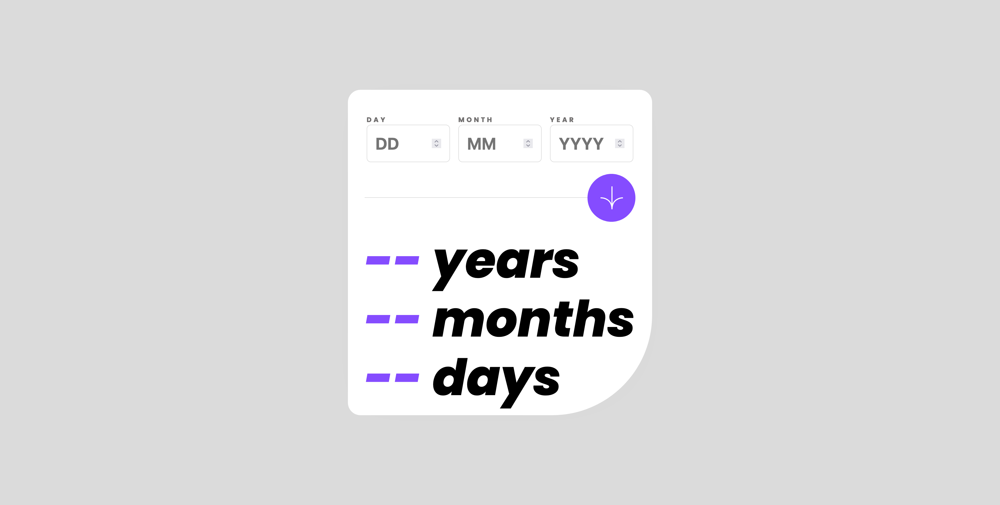

# Frontend Mentor - Age calculator app solution

This is a solution to the [Age calculator app challenge on Frontend Mentor](https://www.frontendmentor.io/challenges/age-calculator-app-dF9DFFpj-Q). Frontend Mentor challenges help you improve your coding skills by building realistic projects. 

## Table of contents

- [Overview](#overview)
  - [Screenshots](#screenshots)
  - [Links](#links)
- [My process](#my-process)
  - [Built with](#built-with)
- [Author](#author)

## Overview

### Screenshot
Desktop version:
  
Mobile version:   
[Mobile Screenshot](./screenshots/mobile.png)  

### Links

- Solution URL: [GitHub Repo](https://github.com/joysterr/fm-age-calculator)  
- Live Site URL: [GitHub Pages](https://joysterr.github.io/fm-age-calculator)  

## My process
### Built with

- HTML, form validation
- Vanilla CSS
- JS

## Author

- GitHub - [@joysterr](https://github.com/joysterr)
- Frontend Mentor - [@joysterr](https://www.frontendmentor.io/profile/joysterr)